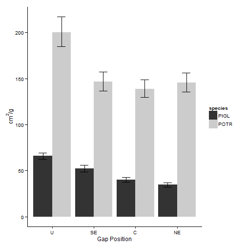

Influence of gap position and site preparation on gas exchange dynamics and leaf area of *Picea glauca* and *Populus tremuloides* seedlings in mixedwood stands
========================================================

### Nathan E. Rutenbeck^1, Brent R. Frey^2, Graeme P. Berlyn^3, Oswald J. Schmitz^3, Bruce C. Larson^4, Mark S. Ashton^3

**1. University of Maine, School of Forest Resources, Orono, Maine**

**2. Department of Forestry, Mississippi State University, MS**

**3. Yale University, School of Forestry and Environmental Studies, New Haven, CT**

**4. Faculty of Forestry, University of British Columbia Vancouver, BC, Canada**

Abstract
--------

One challenge for managers of boreal and sub-boreal mixedwood stands is to successfully establish and maintain the competitive status of white spruce (*Picea glauca* (Moench) Voss in relation to aspen (*Populus tremuloides* Michx.) and other competitors following harvesting. Underplanting spruce within harvest gaps has been suggested as one potential strategy, but questions remain regarding  the kind of harvest gap environment most conducive to the growth of spruce in relation to aspen. We used linear mixed-effects models to test the effect of harvest gap position and Meri-crusher versus brush-saw vegetation treatment on leaf area per wet weight, leaf photosynthesis, stomatal conductance, and transpiration in low- and full-light conditions, and on photosynthetic plasticity to changing light conditions. Overall aspen maintained higher leaf area per unit wet weight than spruce across the gap, but spruce leaf area was more sensitive to changes in gap position. Aspen also maintained higher photosynthesis and transpiration rates than spruce under both light conditions and in both vegetation treatments, but the magnitude of difference in gas exchange rates between the two species depended significantly on vegetation treatment and gap position for photosynthesis, and on gap position for transpiration. Plasticity of photosynthetic response to changes in light were not significantly different for both species, and did not vary significantly for either species between gap positions or site prapartion treatments.

Introduction
------------

Throughout the North American boreal and sub-boreal forests a natural disturbance regime of relatively frequent catastrophic fires (Armstrong 1999) facilitates the occurrence of trembling aspen (*Populus tremuloides* Michx.) and white spruce (*Picea glauca* (Moench) Voss) in both single- and stratified mixed-species stands. On mixedwood sites of this region (Rowe 1972), aspen is an early-successional pioneer, dominating during stand initiation and stem exclusion phases of stand development (sensu Oliver and Larson 1996). Following fire events, aspen typically regenerates quickly through vigorous root suckering to form a dense, closed canopy within about five years (Frey et al. 2002, Bokalo et al. 2007). Initial colonization by aspen is then followed by a period of intense competition and self-thinning before maturity at around 60-80 years, at which point the aspen component of the stand begins to decline. White spruce can enter these stands via two principal pathways. Spruce can establish via initial floristics, colonizing immediately following disturbance alongside aspen or it can establish later in stand development with the formation of canopy gaps (Dix and Swan 1971, Rowe and Scotter 1973, DeLong 1991, Youngblood 1995, Lieffers et al. 2002). In either case, on mixedwood sites growth of the more shade-tolerant spruce typically lags behind that of the more intolerant aspen, with the spruce component occupying the lower strata beneath aspen for several decades until releasing disturbance events (Nienstadt and Zasada 1990, Peterson and Peterson 1992, Lieffers et al. 1996, Brais et al. 2004).

Because of the economic value of white spruce, however, managers of these forests often seek to generate spruce volumes on a shorter time scale than the natural dynamics of mixedwood stands would ordinarily facilitate. Doing so has frequently meant converting these stands to intensively managed spruce plantations that rely on site preparation and chemical methods to control the establishment and competitive status of the white spruce crop trees in relation to hardwood competitors. While such intensive management practices are undeniably an integral component of the suite of forest land uses at the landscape level (Seymour and Hunter 1992), they are neither appropriate for all sites nor for achieving all management objectives. This is especially the case given that such intensive methods have been shown to have relatively high costs, variable rates of success, and can be subject to intense public disapproval (Navratil 1991, Lieffers and Beck 1994). Compared to intensive, single-species plantations, more extensively managed mixed spruce-aspen forests can also offer considerable benefits, including providing greater protection of biodiversity, (Hunter 1991, Burton et al. 1992, Macdonald and Fenniak 2007), increased ecosystem resilience (sensu Holling 1973), potential increases in stand-level productivity (Man and Lieffers 1999, MacPherson et al. 2001), lower susceptibility to damage from insects and pests (Comeau 1996), and greater public acceptance due to reduced herbicide use and improved aesthetic appearance. 

These factors have led to considerable interest in the development of more extensive silvicultural systems to produce fully-stocked spruce-aspen mixtures that are still commercially productive within typical investment time-frames and financial constraints. Various strategies have been suggested to successfully manage these mixedwood stands, including shelterwood systems, strip clearcuts, and underplanting within two-stage selection variable retention harvesting systems (Lieffers et al. 1996, Kabzems 2001, Man and Lieffers 1999b, Comeau et al 2005). Just as in more intensively managed plantations, however, silvicultural success in mixedwood stands will depend on the ability of forest managers to reliably secure adequate spruce regeneration and ensure its competitive status with respect to aspen, particularly during the juvenile growth stage. Enrichment underplanting of white spruce beneath aspen or within canopy gaps has been suggested as feasible a way of compensating for the difficulties associated with securing natural regeneration. Even following successful establishment, however, the relatively slow growth rate of white spruce is often severely limited by competition from other woody plants and herbaceous vegetation, especially in the high-resource environments that typify post-fire sites and other open environments (Hogg and Lieffers 1991, Lieffers and Beck 1994, Cole et al 2003, Filipescu and Comeau 2007, Bokalo et al. 2007, Cortini et al 2012). 

The regeneration ecology of spruce in naturally developing mixedwood stands does suggest that a gap-based approach to management may ultimately prove successful in promoting the establishment and growth of underplanted spruce. It is well-known that a gradient in microclimatic conditions and resource availability exists across gaps in the northern hemisphere, with the northern edge experiencing more accentuated temperature and lower moisture in both the soil air than the southern edge (Canham 1995, Voicu and Comeau 2006). Given differences in spruce and aspen ecology that should result in niche partitioning across the gap environment, certain positions within harvest gaps should theoretically prove more conducive to the successful establishment and growth of white spruce than others. Microclimatic variability within gaps has indeed been associated with differential growth rates of white spruce seedlings (Milakovsky et al 2011). Some evidence suggests that compared to aspen spruce may trade off net assimilation in order to avoid water stress by more tightly controlling stomatal aperture in the high temperature, low moisture environments typical of exposed conditions (Marsden et al. 1996, Groot et al. 1997), but the drivers of such differences in observed growth rate and competitive status across the gap environment remain poorly understood. 

The objective of this study was to contribute to current understandings of the physiological mechanisms behind observed differences in growth and competitive dynamics between juvenile white spruce and trembling aspen across the gap environment and under different site preparation techniques. For white spruce and tembling aspen seedlings located within harvest gaps in transects prepared with either a brush saw or Meri-crusher treatment we measured leaf area per unit weight weight and took measurements of photosynthesis (A$_{net}$) and transpiration (E) rates at photosynthetic photon flux densities of 50 $\mu mol$ m$^{-2}$ s$^{-1}$ and 1200 $\mu mol$ m$^{-2}$ s$^{-1}$ in each of five gap positions - southern understory (SU), southern edge (SE), center &#40;C), northern edge (NE), and northern understory (NU). From photosynthesis and transpiration rates we also calculated an index value measuring plasticity of photosynthetic response to differences in the two light conditions (PPI). We then used linear mixed-effects models to test the effect of harvest gap position and Meri-crusher versus brush-saw vegetation treatment on leaf area per wet weight, photosynthetic plasticity index, and leaf photosynthesis, transpiration, water-use efficiency at low-light and full-light conditions.

Methods
-------

### Field Methods

Additional information regarding site layout and experimental design can be found in Milakovsky et al. (2011). The area of study is in west-central Saskatchewan, Canada, near the community of Meadow Lake, on lands owned by the Cree First Nation and managed by Mistik Management Ltd. This region lies within the Boreal Plain Ecozone, a transition between prairie to the south and the Boreal Shield in the north of the province (MacLaughlan et al 2010). Soils in this region are classified as gray luvisols on sandy loam subsoil (Agriculture Canada 1992). The climate of the study area is continental, with mean annual precipitation of around 406 mm, and average temperatures ranging from a daily mean high of -13.7 C in January to 24.2 C in July (Environment Canada 1993). Forest vegetation includes mixed forests of predominantly white spruce and trembling aspen, blending with minor overstory components of balsam poplar, jack pine, and black spruce. 

In 1997, four experimental linear gaps (ELGs) were created within each of two experimental blocks in which a TIMCO feller-buncher removed all trees greater than two meters in height. Gaps measured 340 meters (E-W axis) by 80 meters (N-S axis) and were arranged north-south within the stand, with a 100 meter buffer of uncut forest between each gap. Within each ELG, nine transects were laid out to which unique combinations of three herbivory exclosure and three vegetation management treatments were applied. The vegetation management treatments included a Meri-Crusher treatment that destroyed all residual vegetation and harvesting slash, a release treatment in which residual vegetation was cut using a brush saw, and a control treatment in which no management was applied. The herbivory exclosure treatments were not experimental factors in this study, but are detailed in Milakovsky et al. (2011). 

Five transects were chosen from three of the ELGs, (three release treatments and two sprout treatments, without herbivory exclosure) in which to conduct gas exchange measurements. Within each transect five 4m wide ( N-S) gap positions were delimited: southern understory (SU: 20 meters from the southern edge of the ELG into the forest), southern edge (SE: the first four meters of opening at the southern side of the ELG), center (C: centered 40 meters from the N and S edges of the ELG), northern edge (NE: the first four meters of opening at the northern side of the ELG), and northern understory (NU: 20 meters from the northern edge of the ELG into the forest). 

Within each gap position, we established a single centered 4 x 8 meter plot, further subdivided into eight 2 x 2 meter subplots. Four out of eight 2 x 2 meter subplots at each gap position were randomly selected for spruce plantings, within which nine 4-month-old containerized white spruce seedlings were planted at 1 x 1 meter spacing during the first two weeks of June, 1996. Therefore for each gap position within an ELG a total of 36 seedlings (9 seedlings x 4 subplots) were planted. Planted spruce seedlings were of native provenance from the Mistik Management Nursery stock, averaging 15 cm in height at the time of planting. Aspen seedlings within these subplots were all naturally occurring. Gap positions and plots were laid out prior to harvesting of the openings, and harvesting machinery was confined to trails between gap positions so as to prevent soil compaction and damage to residual vegetation.

Measurements were collected over three consecutive summers, from 1998-2000, with aspen measurements taken from July 2-7, 1998 and from July 25-30, 1999. Spruce measurements taken from July 25-30, 1999 and from June 21-28, 2000. Gas exchange measurements were taken using the Li-Cor (Lincoln, NE) LI-6400 Portable Photosynthesis System. Within each gap position in a given transect, net assimilation rate of CO~2~ (A), stomatal conductance to H~2~O (g~sw~), and transpiration rate (E) were measured twice for six randomly selected individuals at a high light level of 1200 $\mu mol$ m$^{-2}$ s$^{-1}$ photosynthetic photon flux density (PPFD) and at a low light level of 50 $\mu mol$ m$^{-2}$ s$^{-1}$ PPFD. During the 1998 field season, leaf area and wet weight of samples were recorded immediately following the collection of gas exchange measurements. Leaf area samples were collected within the same experimental block from six individuals in each of the five gap positions in two transects.

### Data analysis

All data processing and analyses were conducted in RStudio version 0.97.336 (RStudio 2013) calling Rx64 version 3.0.1 (R Development Core Team 2013). Data visualization was accomplished using the ggplot2 (Wickham 2009), pander (Daroczi 2013), and knitr (Xie 2013) libraries. All mixed-effects models were fit using the lmer() function within the lme4 package (Bates et al. 2013).

Because of imbalances in collection of leaf area data, measurements from the southern and northern understory positions were pooled prior to analysis. Differences in the ratio of leaf area to wet weight (LAW) for spruce and aspen in each of four gap positions were then tested within a mixed model framework with a random effect at the transect level.

In analyzing gas exchange rates, the data were first standardized for leaf area and cleaned of errors by removing negative values and other implausible outliers. Photosynthetic plasticity index (PPI) was defined as $\frac{A_1200-A_50}{A_1200}$. For A, g~sw~, and E, mixed-effects models were fit testing the effect of light level, species, gap position, site preparation and all interaction terms on each response variable, with random effects included for block, transect, plot, and individual to reflect the hierarchical experimental design structure. A PPI model with the same random effects structure was similarly fit testing the effects of species, gap position, site preparation, and all interaction effects. For all models, we examined plots of residuals versus fitted values, normal quantile-quantile plots, histograms of residuals, and observed versus predicted values in order to examine fit and verify assumptions. Following initial model fitting to untransformed data, A, g$_sw$, and E were squareroot transformed, PPI was logit transformed, and models were re-fit in order to meet assumptions of homoscedasticity and normality of residual error.

Significance ($\alpha=0.05$) of fixed-effects for full models were tested using Type II Analysis of Deviance Wald F tests with the Kenward-Rogers adjustment to denominator degrees of freedom implemented using the car package (Fox and Weisberg 2011). Post-hoc pairwise comparisons of marginal means for all treatment levels of experimental fixed-effects were conducted using Tukey's Honestly Significant Differences tests as implemented by the lsmeans package (Lenth 2013).

Results
-------

### Leaf Area

Analysis of deviance results for LAW are displayed in Table 1. Predictably, we found that aspen had higher LAW ratios than spruce in all gap positions, and that both species maintained their highest LAW ratios when in the understory. Within the harvest gap, however, spruce and aspen showed distinctly divergent patterns. Once out of the understory, LAW ratios did not vary significantly for aspen across any of the internal gap positions, while for spruce it declined steadily moving from the southern edge of the gap to the northern edge (Figure 1).

### Gas Exchange

Analysis of deviance results for fixed effects in full gas exchange models are shown in Tables 2-4, and estimates of standard deviations of random effects of experimental design factors are displayed in Table 5. Based on parameter estimates from the full models, there appeared to be a high degree of interaction between experimental factors in all three gas exchange models. Significant four-way interactions between light, species, gap position, and vegetation treatment were indicated by the photosynthesis ($p=$ 0.0054) and stomatal conductance ($p=$ 0.0072) models. Likewise, results from the transpiration model indicated a significant ($p<0.0001$) three-way interaction between light level, species, and gap position. In addition to being difficult to meaningfully interpret, however, the prima facie statistical significance of such high order interactions may at least in part be an artifact of fitting complex models to relatively noisy data, particularly at low light levels, and therefore not entirely demonstrative of strong physiological signals. Even with this caution in mind, however, estimates of gas exchange rates based on post-hoc comparisons of marginal means for fixed effects show some clear differences in patterns of species gas exchange rates in response to experimental factors.

#### Photosynthesis

Post hoc comparisons of spruce and aspen photosythesis rates by light level, gap position, and vegetation treatment are presented in Figure 2. At low light levels there were some differences across gap positions and vegetation treatments, but these differences did not demonstrate a clearly interpretable pattern. In low light levels both spruce and aspen appeared to be similarly limited, with rates in no gap position/vegetation treatment combination conclusively better than any other, and with neither species holding a clear advantage. 

By contrast, at full light aspen photosynthesis rates were both relatively constant and consistently higher than spruce, with the magnitude and significance of these differences between the two species varying by site preparation treatment and gap position. In full light and in transects prepared with the brush saw treatment photosynthesis rates for aspen did not vary significantly by gap position, and were higher than spruce in all gap positions but the center. Spruce showed a more dynamic response, with photosynthesis rates significantly higher in the center than in surrounding gap positions, though with no detectable variation between the other gap positions. 

In transects prepared with the Meri-crusher treatment a wholly different pattern occured, however. Aspen photosynthesis rates were again higher than spruce under full light conditions in four of the five gap positions, but the location in which the two species did not vary significantly was instead the southern understory. Aspen photosynthesis rates were also variable rather than static from one gap position to another, while spruce was instead static. The pattern of aspen photosynthesis rates across gap positions in the Meri-Crusher treatment were both surprising and difficult to interpret given lower rates in the southern understory and center gap positions in comparison to relatively non-significantly different rates in all other gap positions. Because of the difficulties of interpretation of this pattern, it is tempting to regard the relatively low aspen photosynthesis rate in the Meri-Crusher treatment as a statistical artifact. 

#### Stomatal Conductance

Post hoc comparisons of spruce and aspen stomatal conductance by light level, gap position, and vegetation treatment are presented in Figure 3. Aspen stomatal conductance was higher than that of spruce in all gap positions, regardless of changes in vegetation treatment or light level. Neither species showed distinct differences in stomatal conductance under changing light conditions, but aspen also showed very little variation across either gap environment or between site treatments. 

By contrast spruce showed distinctly different patterns in stomatal conductance rates between site preparation treatments, showing a more dynamic response to changes in gap position in the brush saw than the Meri-crusher transects. In brush sawn transects spruce stomatal conductance displayed an increasing pattern from the southern understory, peaking in the center of the gap and falling to very low levels in the northern understory. In transects prepared with the Meri-Crusther treatment, however, spruce stomatal conductance was highest in the southern edge of the gap, and did not vary significantly between all other gap positions.

#### Transpiration

Post hoc comparisons of spruce and aspen transpiration by light level and gap position are presented in Figure 4. Because of the non-significance of differences in vegetation treatment and interactions with vegetation treatment in the transpiration model, these factors were excluded from post-hoc testing. 

Transpiration was higher for aspen than spruce across all gap positions and both light levels, did not vary significantly by gap position within a given light level, and only varied between light levels at the northern edge of the harvest gap. Light level also made little difference in spruce transpiration rates. Similarly to other gas exchange measures, however, spruce showed a more dynamic response to changing gap position than aspen, with peak transpiration rates at the southern edge and center of the gap, and lowest transpiration rates in the two understory positions. 

Discussion
----------

Determining post-harvest conditions that are conducive to maintaining the competitve status of white spruce with respect to hardwood species such as aspen is crucial in formulating silvicultural strategies for successfully regenerating and managing growth in boreal mixedwood forests. Understanding the fundamental physiological characteristics that are the drivers of the competitive dynamics between these species is important in designing the timing and spatial patterns of harvests so as to generate the microenvironmental characteristics that will facilitate spruce survival and maximize growth. This study identifies significant differences between spruce and aspen in terms of leaf area and gas exchange rates in response to changing light conditions within different gap positions and subject to different site preparation treatments that reflect the distinct roles these species play in the development of mixedwood stands. Though at low light levels differences between the two species were either not present or overly difficult to interpret, at high light levels some clear patterns emerged that provide insight regarding the competitive dynamics of the two species. 

At high light levels in the brush saw treatment, aspen showed very little difference in either leaf area or gas exchange rates across gap position and vegetation treatments. The ability of aspen to display high leaf area per unit weight largely without regard to harvest gap positions and associated differences in microclimate is characteristic of the 'go for broke' strategy of an early-successional, short-lived species that is extremely competitive in a high-light environments. Based on our data, aspen would appear to have the capacity to maintain open stomates regardless of temperature, moisture, and light differences between microsites. This ability may be related to its nature as a prolific sprouter, which lends seedlings a more robust root system for access to water. In this case, given the ability to maintain such high gas exchange rates, maximizing leaf area per unit leaf wet weight should result in higher growth and competitive advantage in comparison to more shade-tolerant moisture sensitive species such as white spruce.

By contrast, the successional role of white spruce in natural stands depends on the ability to persist beneath an aspen overstory, often for several decades. The role of spruce within these stands is therefore one that is characterized by slower initial growth but greater longevity and dynamic response to changes in stand structure in which spruce is forced to adapt to changes in light, moisture and temperature characteristics through extended episodes of competition and release. Given this typical life history, then the ability to adapt photosynthetic physiology to microsite characteristics and thereby maintain a more finely-tuned balance between water loss and carbon gain is of theoretical advantage in both persisting across a variety of sites and in responding to changes in stand structure over time. 

The optimal post-harvest microsite conditions in terms of maximizing the competitive status of spruce with respect to aspen as indicated by our data appears to be the center of gaps prepared with the lower-impact brush saw site preparation treatment in comparison to the higher-impact Meri-Crusher. Photosynthesis and stomatal conductance rates for spruce were highest in these locations, and photosynthesis rates did not differ significantly in these plots from those of aspen. These conclusions regarding optimal gap position corroborate growth measurements made by Milakovsky et al. (2011), who found that folowing an acclimation period in which ameliorative cover benefitted spruce, by the third year following planting white spruce hight increment was highest in the center of the experimental linear gaps. Growth data from Milakovsky et al. showed, however, that height growth was highest for spruce in sites prepared with the Meri-crusher treatment

Bibliography
------------

Appendix 1: Tables
------------------

-------------------------------------
&nbsp;    F    Df   Df.res     Pr(>F)
--------- ---- ---- -------- --------
**S**     658  1    95.2      1.6e-44

**G**     26.2 3    95.1     1.98e-12

**S*G**   3.51 3    95.1       0.0182
-------------------------------------

Table: Analysis of Deviance results on differences in leaf area per unit wet weight for species and gap position. The standard deviation of the modeled random effect for transect was 6.0441 and the standard deviation of the residual error at the individual level was 21.6106

| &nbsp;        | F      | Df   | Df.res   |    Pr(>F) |
|:--------------|:-------|:-----|:---------|----------:|
| **L**         | 4677   | 1    | 590      | 1.11e-282 |
| **S**         | 724    | 1    | 187      |  2.69e-66 |
| **G**         | 0.203  | 4    | 10.3     |     0.931 |
| **V**         | 0.0157 | 1    | 1.49     |     0.915 |
| **L*S**       | 490    | 1    | 597      |  1.05e-79 |
| **L*G**       | 33.9   | 4    | 591      |  1.82e-25 |
| **S*G**       | 21     | 4    | 198      |  2.02e-14 |
| **L*V**       | 29.7   | 1    | 592      |  7.32e-08 |
| **S*V**       | 15.9   | 1    | 145      |  0.000105 |
| **G*V**       | 0.564  | 4    | 10.1     |     0.694 |
| **L*S*G**     | 2.98   | 4    | 598      |    0.0188 |
| **L*S*V**     | 23.2   | 1    | 605      |  1.86e-06 |
| **L*G*V**     | 8.99   | 4    | 594      |  4.71e-07 |
| **S*G*V**     | 2.96   | 4    | 82       |    0.0244 |
| **L*S*G*V**   | 3.71   | 4    | 607      |   0.00541 |

Table: Results from Analysis of Deviance on the effects of light level (L), species (S), gap position (G), vegetation treatment (V), and all interactions on photosythesis rate

| &nbsp;        | F       | Df   | Df.res   |   Pr(>F) |
|:--------------|:--------|:-----|:---------|---------:|
| **L**         | 11      | 1    | 565      | 0.000952 |
| **S**         | 339     | 1    | 180      | 2.79e-43 |
| **G**         | 1.37    | 4    | 9.33     |    0.316 |
| **V**         | 0.00203 | 1    | 1.56     |    0.969 |
| **L*S**       | 6.37    | 1    | 568      |   0.0119 |
| **L*G**       | 6.67    | 4    | 565      | 3.01e-05 |
| **S*G**       | 3.43    | 4    | 175      |     0.01 |
| **L*V**       | 1.7     | 1    | 566      |    0.193 |
| **S*V**       | 0.831   | 1    | 90.4     |    0.364 |
| **G*V**       | 2.35    | 4    | 9.1      |    0.132 |
| **L*S*G**     | 0.652   | 4    | 569      |    0.626 |
| **L*S*V**     | 0.135   | 1    | 572      |    0.713 |
| **L*G*V**     | 3.55    | 4    | 567      |  0.00709 |
| **S*G*V**     | 1.02    | 4    | 79.3     |      0.4 |
| **L*S*G*V**   | 3.55    | 4    | 572      |  0.00719 |

Table: Results from Analysis of Deviance on the effects of light level (L), species (S), gap position (G), vegetation treatment (V), and all interactions on stomatal conductance rates

| &nbsp;        | F        | Df   | Df.res   |   Pr(>F) |
|:--------------|:---------|:-----|:---------|---------:|
| **L**         | 71.5     | 1    | 565      | 2.42e-16 |
| **S**         | 385      | 1    | 189      | 1.84e-47 |
| **G**         | 0.522    | 4    | 9.93     |    0.722 |
| **V**         | 0.000224 | 1    | 1.81     |     0.99 |
| **L*S**       | 6.14     | 1    | 568      |   0.0135 |
| **L*G**       | 11.8     | 4    | 566      | 3.42e-09 |
| **S*G**       | 3.54     | 4    | 193      |  0.00812 |
| **L*V**       | 0.351    | 1    | 566      |    0.554 |
| **S*V**       | 0.105    | 1    | 168      |    0.747 |
| **G*V**       | 0.314    | 4    | 9.74     |    0.862 |
| **L*S*G**     | 3.49     | 4    | 569      |  0.00785 |
| **L*S*V**     | 0.847    | 1    | 572      |    0.358 |
| **L*G*V**     | 0.677    | 4    | 567      |    0.608 |
| **S*G*V**     | 1.07     | 4    | 77.4     |    0.378 |
| **L*S*G*V**   | 1.11     | 4    | 573      |    0.353 |

Table: Results from Analysis of Deviance on the effects of light level (L), species (S), gap position (G), vegetation treatment (V), and all interactions on transpiration rates

| &nbsp;               | Block     | Transect   | Plot    | Tree    | Residual   |
|:---------------------|:----------|:-----------|:--------|:--------|:-----------|
| **Photosynthesis**   | 0.4133    | 0          | 0.3505  | 0.192   | 0.3621     |
| **Conductance**      | 0.007763  | 0.02554    | 0.05196 | 0.07564 | 0.05163    |
| **Transpiration**    | 3.018e-05 | 0.1312     | 0.2022  | 0.1995  | 0.1419     |

Table: Standard deviations of experimental random effects for each of the three gas exchange models

Appendix 2: Figures
--------------------

 

 

 

 

